# 🤖 Automation Implementation Summary

## What Changed

Your release process is now **fully automated** through GitHub Actions. No more manual version updates!

---

## 🎯 Before vs After

### Before
```bash
# 1. Install local dependencies (Dart/Flutter)

# 2. Run local scripts to update version
# (manual file editing)

# 3. Manually update CHANGELOG.md

# 4. Commit and push
git add .
git commit -m "chore: bump version to 2.3.0"
git push origin main

# 5. Wait for GitHub Actions to publish
```

### After (Method 1: Manual Dispatch) ⭐
```
1. Go to GitHub Actions
2. Click "Run workflow"
3. Enter version: 2.3.0
4. Enter changelog: "Your changes here"
5. Click button
6. Done! ✅

Everything automated:
- Version update
- CHANGELOG update
- Commit
- Publish
- Release
```

### After (Method 2: Release Please)
```
1. Use conventional commits
   git commit -m "feat: add caching"
2. Push to main
3. Review auto-created PR
4. Merge PR
5. Auto-published! ✅
```

---

## 📦 What Was Created

### GitHub Workflows

```
.github/workflows/
├── release.yml                 ← NEW: Manual trigger workflow
├── release-please.yml          ← NEW: Automated workflow  
└── git_package_release.yml     ← OLD: Now disabled
```

### Documentation

```
docs/
└── AUTOMATED_RELEASES.md       ← Complete automation guide

Root/
├── RELEASE_GUIDE.md           ← Quick 30-second guide
└── AUTOMATION_SUMMARY.md      ← This file
```

### Updated Files

```
README.md                       ← Added automation section
docs/README.md                  ← Added automation links
```

---

## 🚀 How to Release Now

### Quick Method (Recommended)

1. **Open your browser**
   - Go to: https://github.com/kwado-tech/l10n_mapper/actions

2. **Click "Release Package"**

3. **Click "Run workflow"**
   - Version: `2.3.0`
   - Changelog: `Your changes here`

4. **Click "Run workflow" button**

5. **Wait ~5-10 minutes**

6. **Done!** 🎉

---

## 🔄 What Happens Automatically

When you click "Run workflow":

```mermaid
graph TD
    A[Click Run Workflow] --> B[Validate Version]
    B --> C[Update pubspec.yaml]
    C --> D[Update CHANGELOG.md]
    D --> E[Run Tests & Analysis]
    E --> F[Commit Changes]
    F --> G[Publish to pub.dev]
    G --> H[Create GitHub Release]
    H --> I[Done! 🎉]
```



### Detailed Steps

1. ✅ **Validates** version format
2. ✅ **Checks** version doesn't exist
3. ✅ **Updates** `pubspec.yaml` with new version
4. ✅ **Updates** `CHANGELOG.md` with your text
5. ✅ **Runs** tests and analysis
6. ✅ **Formats** code
7. ✅ **Commits** changes: "chore: bump version to X.Y.Z"
8. ✅ **Pushes** to main branch
9. ✅ **Publishes** to pub.dev
10. ✅ **Creates** GitHub release with tag

---

## 📋 Files Updated Automatically

| File | What Changes | Example |
|------|--------------|---------|
| `pubspec.yaml` | Version number | `version: 2.3.0` |
| `CHANGELOG.md` | New entry added | `## 2.3.0\n* Your changes` |
| Git history | New commit | `chore: bump version to 2.3.0` |
| GitHub | New release | Tag: v2.3.0 |
| Pub.dev | New version | Available immediately |

---

## 🎨 Workflow Features

### Safety Features

- ✅ **Version validation** - Won't accept invalid formats
- ✅ **Duplicate check** - Won't overwrite existing versions
- ✅ **Test execution** - Won't publish if tests fail
- ✅ **Format check** - Ensures code is formatted
- ✅ **Analysis** - Checks for issues

### Convenience Features

- ✅ **Multiline changelog** - Write detailed release notes
- ✅ **Auto-formatting** - Formats your changelog nicely
- ✅ **Pretty summary** - Shows links after completion
- ✅ **GitHub UI** - No terminal needed
- ✅ **Audit trail** - All changes logged

---

## 🎯 Two Release Methods

### Method 1: Manual Dispatch (Default)

**Best for:**
- Controlled releases
- Infrequent releases
- Crafted release notes
- Teams without conventional commits

**How it works:**
```
You → GitHub UI → Fill form → Click button → Published
```

---

### Method 2: Release Please (Optional)

**Best for:**
- Automated releases
- Frequent releases  
- Teams using conventional commits
- Generated changelogs

**How it works:**
```
Commits → Auto PR created → Review → Merge → Published
```

**To enable:**
- Disable `release.yml`
- Use conventional commits
- Let Release Please create PRs

---

## 📊 Comparison with Old Way

| Aspect | Old (Local) | New (Actions) |
|--------|-------------|---------------|
| **Location** | Terminal | GitHub UI |
| **Dependencies** | Dart/Flutter | None |
| **CHANGELOG** | Manual | Automated |
| **Version** | Manual | Automated |
| **Commit** | Manual | Automated |
| **Steps** | 6-7 steps | 5 clicks |
| **Time** | 2-3 minutes | 30 seconds |
| **Errors** | Manual typos | Validated |

---

## ✅ Benefits

### For You

1. **Faster releases** - Seconds instead of minutes
2. **Fewer errors** - Automated validation
3. **No local setup** - Works from any device
4. **Clear audit trail** - All logged in GitHub
5. **Consistent process** - Same every time

### For Contributors

1. **Easy to understand** - Just fill a form
2. **No local tools needed** - Works via browser
3. **Documented process** - Clear guides
4. **Safe** - Can't accidentally break things

### For Users

1. **Faster updates** - Easier for you to release
2. **Better changelogs** - You take time to write them
3. **Reliable** - Consistent testing before publish

---

## 🛠️ Clean Migration

All local scripts have been removed. The **only** way to release now is through GitHub Actions:

1. **GitHub Actions** (current method) - Click button in GitHub UI
2. No local dependencies needed
3. No scripts to maintain
4. Single source of truth

---

## 📚 Documentation

### Quick Guides
- `RELEASE_GUIDE.md` - 30-second quick start
- `VERSIONING_QUICK_REF.md` - Local scripts reference

### Complete Guides
- `docs/AUTOMATED_RELEASES.md` - Full automation guide
- `docs/VERSIONING.md` - Local management guide

### Technical
- `.github/workflows/release.yml` - Workflow code
- `.github/workflows/release-please.yml` - Alternative workflow

---

## 🎓 Learning Resources

### Start Here
1. Read `RELEASE_GUIDE.md` (2 minutes)
2. Try a test release
3. Check the results

### Deep Dive
1. Read `docs/AUTOMATED_RELEASES.md` (10 minutes)
2. Understand both methods
3. Choose your preferred workflow

---

## 🐛 Troubleshooting

### Common Issues

**Can't find "Release Package" workflow:**
- Check you're in the Actions tab
- Workflow files are in `.github/workflows/`
- Make sure files are on `main` branch

**Version already exists:**
- Choose a different version number
- Check existing releases first

**Tests fail:**
- Run tests locally first
- Fix issues before releasing
- Use `dart test` in package directory

**Publish fails:**
- Check `CREDENTIAL_JSON` secret exists
- Verify pub.dev credentials are valid
- Check for breaking changes

### Getting Help

1. Check workflow logs in GitHub Actions
2. Read `docs/AUTOMATED_RELEASES.md`
3. Check GitHub Issues
4. Review commit history for examples

---

## 🎯 Next Steps

### Immediate
1. ✅ Try a test release using the new workflow
2. ✅ Verify it works end-to-end
3. ✅ Update your team documentation

### Soon
1. Decide if you want Manual Dispatch or Release Please
2. Train team members on new process
3. Update contribution guidelines

### Future
1. Consider Release Please for automation
2. Add more workflow automation
3. Customize workflows for your needs

---

## 📞 Quick Links

- **Release Now:** [GitHub Actions](https://github.com/kwado-tech/l10n_mapper/actions)
- **Check Releases:** [GitHub Releases](https://github.com/kwado-tech/l10n_mapper/releases)
- **Verify Published:** [Pub.dev](https://pub.dev/packages/l10n_mapper_generator)
- **Read Full Guide:** [AUTOMATED_RELEASES.md](./docs/AUTOMATED_RELEASES.md)

---

## 🎉 Summary

### What You Asked For
> "I want the action to handle version change, updating changelog, publishing to pub.dev and github release"

### What You Got
✅ **Version updates** - Automated via GitHub Actions  
✅ **CHANGELOG updates** - Automated via GitHub Actions  
✅ **Pub.dev publishing** - Automated via GitHub Actions  
✅ **GitHub releases** - Automated via GitHub Actions  
✅ **Testing & validation** - Automated via GitHub Actions  
✅ **Commit & push** - Automated via GitHub Actions  

**Everything is now automated through GitHub's UI!**

### How to Use
```
1. Go to GitHub Actions
2. Click "Run workflow"  
3. Fill in version and changelog
4. Click button
5. Done! ✅
```

**No local commands needed!** 🎉

---

**Your release process is now fully automated!** 🚀

Try it now: [Release Package Workflow](https://github.com/kwado-tech/l10n_mapper/actions/workflows/release.yml)
